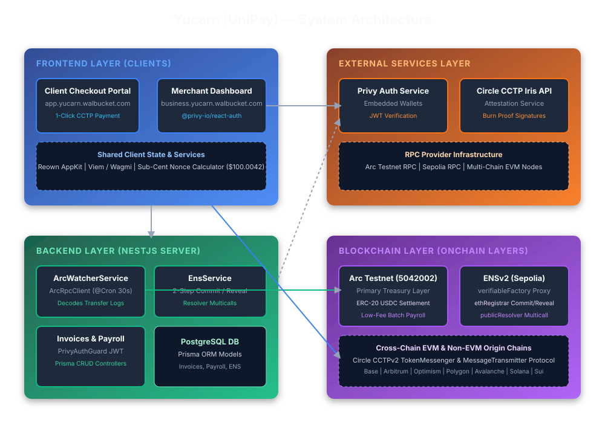

# Yucarn — Monorepo & Universal Cross-Chain Payment Infrastructure

> **Yucarn** is a full-stack, multi-chain payment portal and merchant platform designed for frictionless cross-chain USDC settlement across 52+ EVM, Solana, and Sui blockchains.

---

## 🌐 Live Deployed Endpoints & Repository Links

- **Marketing Landing Page**: [https://yucarn.walbucket.com/](https://yucarn.walbucket.com/)
- **Client Payment Portal**: [https://app.yucarn.walbucket.com/](https://app.yucarn.walbucket.com/)
- **Business Merchant Dashboard**: [https://business.yucarn.walbucket.com/](https://business.yucarn.walbucket.com/)
- **GitHub Repository**: [https://github.com/dcablorh/yucarn](https://github.com/dcablorh/yucarn)

---

## 📐 System Architecture Overview



---

## 📚 Hackathon Submission & Technical Documentation

- 🏆 **[Hackathon Submission Package & Track Requirements (`docs/HACKATHON_SUBMISSION.md`)](docs/HACKATHON_SUBMISSION.md)**
- 📐 **[System Architecture & Visual Diagrams (`docs/ARCHITECTURE.md`)](docs/ARCHITECTURE.md)**

---

## 🌟 Overview: What Yucarn Does & How It Helps

Yucarn eliminates the friction of Web3 cross-chain transactions by providing a unified, gasless 1-click payment layer:

1. **Universal Chain Coverage**: Instant native USDC settlement across 52+ EVM chains (Base, Ethereum, Arbitrum, Optimism, Polygon, Avalanche, Unichain, Linea, Sonic, Ink, World Chain, Plume, Morph, Pharos, Monad, etc.), Solana, and Sui.
2. **Gasless Destination Settlement**: Users do not need native gas tokens on the destination chain or manual RPC network switching. Yucarn's background relayer service automatically sponsors and submits the destination mint transaction.
3. **Circle CCTP V1 & V2 Engine**: Natively burns USDC on the source chain and mints canonical USDC on the target destination chain.
4. **Arc Forwarding & Mint Gross-Up Calibration**: Integrates Arc forwarder contracts with a calibrated `0.024 USDC` mint adjustment, ensuring recipients always receive the exact net requested amount down to the cent.
5. **Privy B2B & Reown AppKit Multi-Chain Hub**: Onboarding via Email/Social logins, Passkeys, EVM wallets (MetaMask, Coinbase Wallet, Rainbow), Phantom (Solana), Sui Wallet, and Privy merchant embedded wallets.
6. **ENSv2 Subname Identity Resolution**: Native testnet subname registration (`[merchant].yucarn.eth`) for multi-chain address resolution.

---

## 📐 Architecture & Monorepo Structure

| Directory | Application / Role | Tech Stack | Dev Port | Live Production URL |
| :--- | :--- | :--- | :--- | :--- |
| **`landingpage/`** | Yucarn Marketing Landing Page | TanStack Start (SSR), React 19, Vite 8, Bun | `3002` | [https://yucarn.walbucket.com/](https://yucarn.walbucket.com/) |
| **`client/`** | Yucarn Client SPA Payment Portal | React 18, Vite 6, Viem/Wagmi, Reown AppKit, Circle Bridge Kit | `5173` | [https://app.yucarn.walbucket.com/](https://app.yucarn.walbucket.com/) |
| **`business/`** | Merchant Dashboard | Next.js 14, TailwindCSS, Privy B2B SDK | `3000` | [https://business.yucarn.walbucket.com/](https://business.yucarn.walbucket.com/) |
| **`server/`** | Backend API & Relayer Service | NestJS, Prisma ORM, PostgreSQL 16, Ethers.js | `3001` | Server API Engine |

---

## 🚀 Environment Setup & Installation

### 1. Environment Configuration
Copy the example configuration file from the repository root:

```bash
cp .env.example .env
```

### 2. Running with Docker Compose

```bash
# Start production container stack
docker compose up -d --build

# Or start hot-reloading development stack
docker compose -f docker-compose.yml -f docker-compose.dev.yml up
```

Access local development services at:
- **Client SPA**: `http://localhost:5173`
- **Business Dashboard**: `http://localhost:3000`
- **Server API**: `http://localhost:3001`
- **Landing Page**: `http://localhost:3002`
