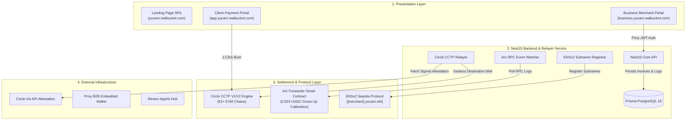
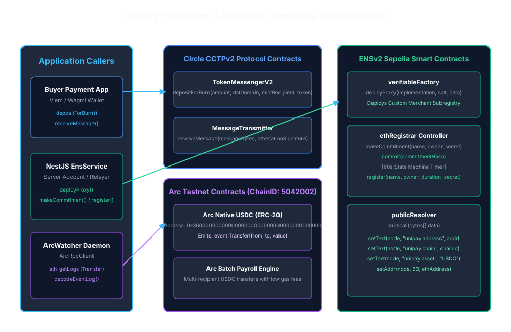
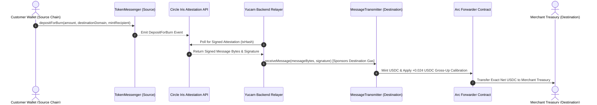
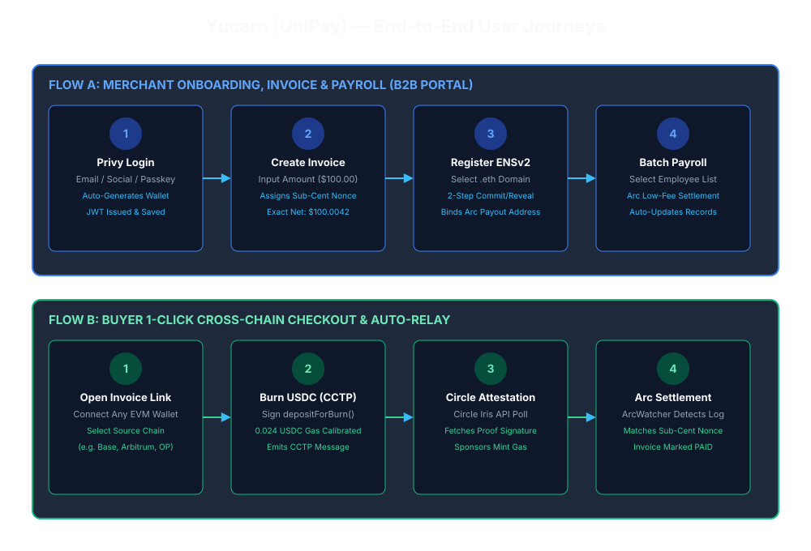
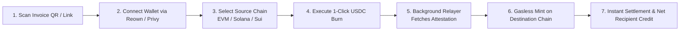

# Yucarn Architecture & System Specification

This document provides visual architecture diagrams and deep technical specifications for **Yucarn** — Universal Cross-Chain Payment & Settlement Infrastructure.

---

## 📐 1. System Architecture Overview

---

## 🔄 2. Smart Contract & Protocol Interaction Flow

---

## 🗺️ 3. End-to-End User Journey

---

## ⚡ 4. Data Flow & Event Processing Architecture

```mermaid
gantt
    title Yucarn Real-Time Cross-Chain Settlement Pipeline
    dateFormat  s
    axisFormat %S sec

    section Payment Initiation
    Client Burn Signature       :active, p1, 0, 3s
    Source Chain Block Confirm  :p2, after p1, 4s

    section Relayer Processing
    Circle Iris Attestation     :crit, p3, after p2, 8s
    Gasless Mint Broadcast      :p4, after p3, 3s

    section Settlement & Sync
    Destination Confirmation    :p5, after p4, 2s
    WebSocket Merchant Alert    :p6, after p5, 1s
```

